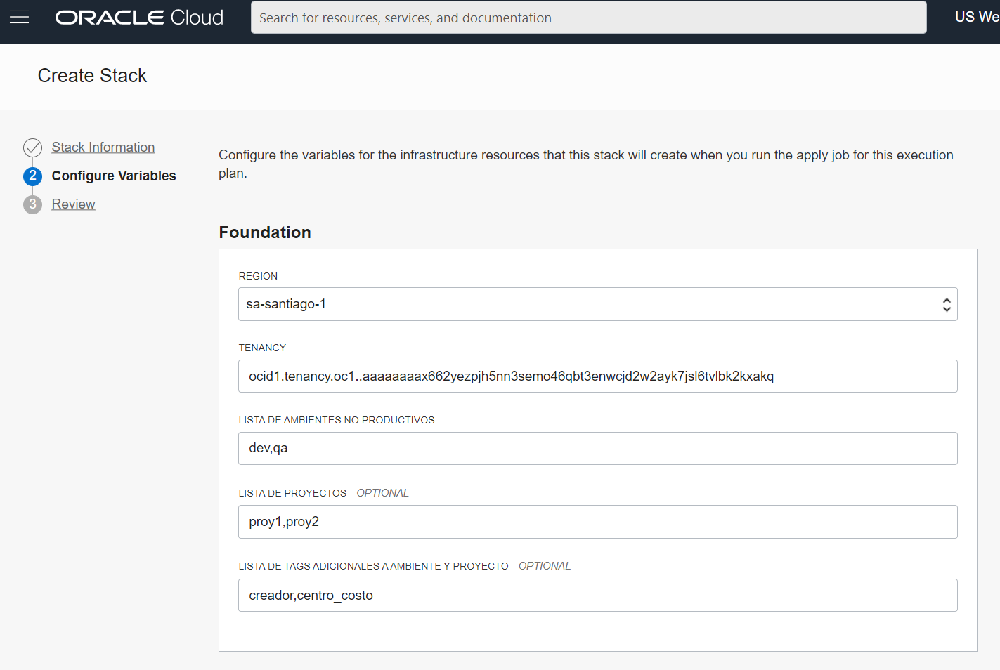

# OCI Foundation
Genera la estructura base en oci de acuerdo a las prácticas mas comunes.

## Estructura generada
### Compartments
- prod
  - prod_security
  - prod_network
  - prod_shared
  - prod_**proy1**
  - prod_**proy2**
- noprod
  - noprod_security
  - noprod_network
  - noprod_shared
  - noprod_sandbox
  - noprod_**dev**
    - noprod_**dev**_**proy1**
    - noprod_**dev**_**proy2**
  - noprod_**qa**
    - noprod_**qa**_**proy1**
    - noprod_**qa**_**proy2**
- shared
  - shared_network
### Grupos
- admin_**nombre_compartment**
### Policies
- admin_**nombre_compartment**
  - Allow group **nombre** to manage all-resources in compartment **nombre**
  - Allow group **nombre** to use virtual-network-family in compartment **correspondiente**
### Tags
- ambiente
  - lista de valores de acuerdo al input
- proyecto
  - lista de valores de acuerdo al input
- cada uno de los indicados como input
## Parámetros
- Lista separada por comas de ambientes no productivos
- Lista separada por comas de proyectos
- Lista separada por comas de tags
  - Por defecto se crean tag por ambiente y proyecto
## Forma de Uso
- Clonar repositorio
- Ir a OCI Console --> Resource Manager --> Stacks
  - Create Stack
    - Seleccionar directorio clonado
    - Llenar variables

